# Flask afternoon goal
The end goal of this afternoon is to have a Flask app using a Bootstrap template deployed on an Amazon AWS EC2 free tier.

So we'll proceed in two parts:
* Part 1: getting a Flask app using a desired Bootstrap template running locally.
* Part 2: getting that app deployed and running on an EC2 instance.

# Preamble  
This guide shows you how to use a Bootstrap 3 template.  Bootstrap 3 was used in the following
deployed app:
 
[Ski run recommender](https://github.com/kfarbman/ski-recommender/)
 
However, Bootstrap 4 has come out.  Bootstrap 4 was used in the following app:
 
[Therapist Recommender](https://github.com/camerongridley/TherapistRecommender)

I (Frank) have heard that Bootstrap 4 is easier to use than 3, though I've never used it.

## Part 0  
Make a `simple_web_app` repo on github.  Initialize it with a README.  Clone it to your laptop. We'll be putting code into it during this lecture.  After the code is pushed, we can clone it on to EC2 as well.

## Part 1  

### Bootstrap

We use CSS to style html pages. With CSS we can control colors, fonts, spacing and anything else about the appearance.

Instead of working with CSS directly we can use Bootstrap which has standard templates.  This guide was written using [Bootstrap version 3.3](https://getbootstrap.com/docs/3.3/) though development has continued on Bootstrap (currently version 4.)  For this assignment, please use version 3.3.  You may wish to consider using a different version for your own case study or capstone.

#### Installation
We'll be downloading code associated with their [examples](https://getbootstrap.com/docs/3.3/getting-started/#examples).  Click on this examples link and once on the page click on the _downloading the Bootstrap repository_ link in blue text, as shown below.

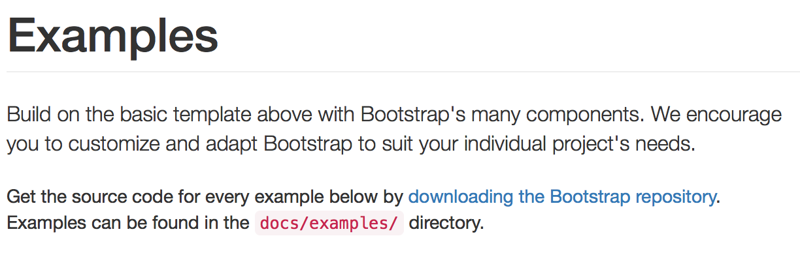

It should be about 5 MB zipped archive that uncompresses to about 11 MB into a directory called `Bootstrap-3.3.7`. It's going to contain the files needed to recreate and then customize our own web page.

#### Starter example
Bootstrap has a bunch of examples built already. It's standard to start with those and modify them for your needs.

Take a look at their [examples](https://getbootstrap.com/docs/3.3/getting-started/#examples) again.

We'll start with the simplest one, the [starter template](https://getbootstrap.com/docs/3.3/examples/starter-template/).

We're going to want to have the following file structure in a folder called something like `web_app`:

web_app  
* `app.py` (this is our flask app)  
* templates/ (contains .html files)  
* static/  
  * css/ (contains .css files)  
  * fonts/  (contains fonts)  
  * js/  (contains .js files)

1. Go to `Bootstrap-3.3.7/dist/` and copy the `css`, `fonts`, and `js` folders.  Paste them into your `static` folder. 

1. In `Bootstrap-3.3.7/docs/examples/starter-template` find the `index.html` file and put that in the `templates` folder.  Then drag the `starter-template.css` file into the `static/css` folder.

1. Now, if you open the `index.html` file in your `templates` folder you should see a region where several files are linked:
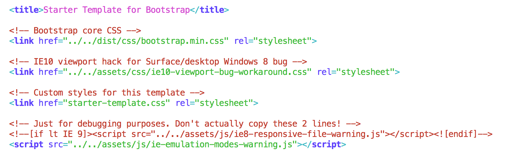

You need to a) find these files in `Bootstrap-3.3.7` and then b) paste them into the following locations in your `static` folder:
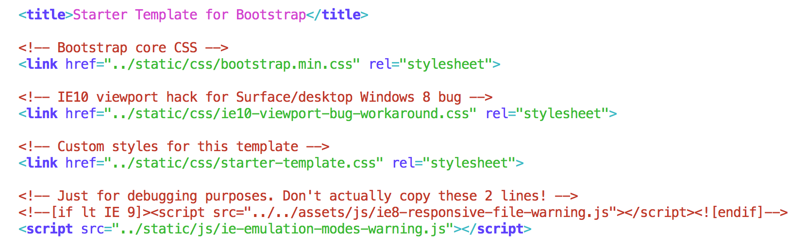

You aren't quite done.  There are some links at the bottom of the `index.html` that need to be updated too:
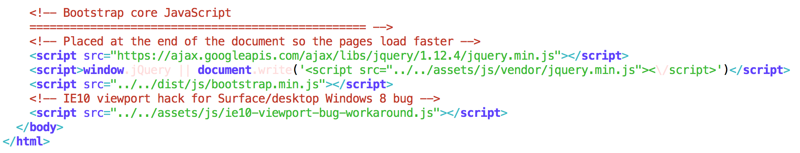

And these links should look like this when you are done:
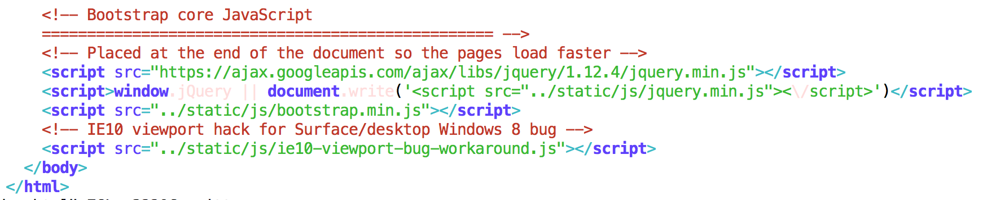

Now see if you can run your app locally.
`$ python app.py`

## Part 2  

1. Get your `web_app` folder up on your Github page. We will be cloning it to our EC2 instance.

1. Log into the AWS Console and Launch an EC2 instance.  
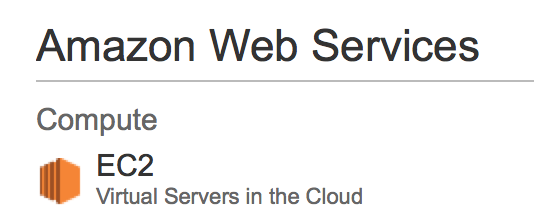

1. Create an instance.  
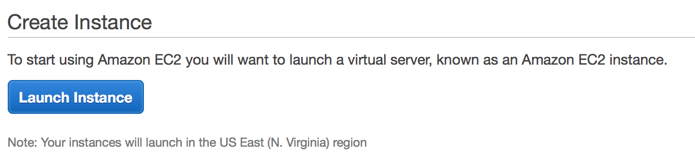

1. Go to community AMI to select a machine image.  Find one with anaconda 3 (probably already has flask installed)

1. Choose a free tier instance.  
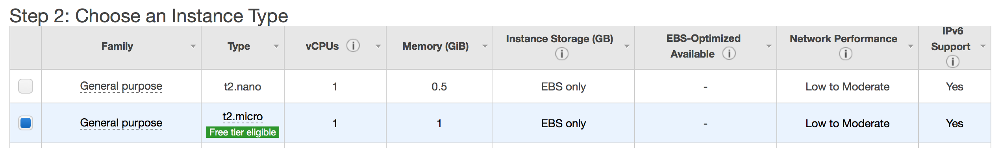

1. Click Configure Instance Details.

1. Click Add Storage.

1. Click Add Tags.

1. Give your tag a name (for instance *my_web_app*).
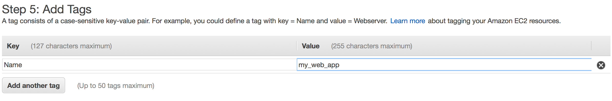

1. Configure your security group by clicking 'Add Rule'.  
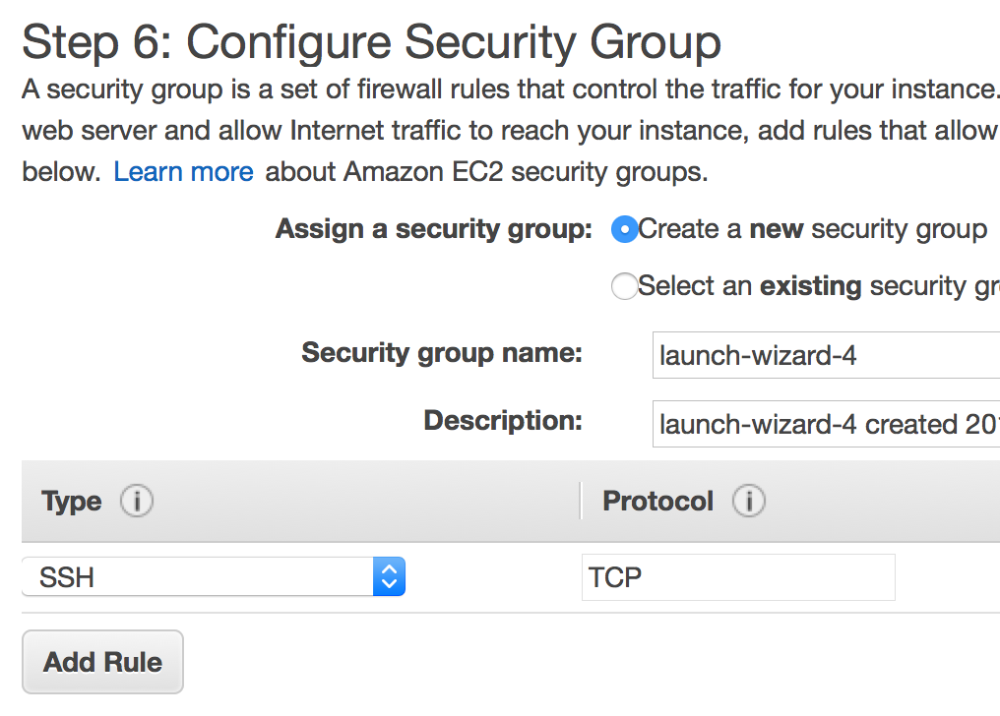

1. Edit inbound rules and select port (using 8105, could use other).  Note that only line you'll need to add below is the third one ('Custom TCP Rule', 'Port Range 8105', 'Source Anywhere').  
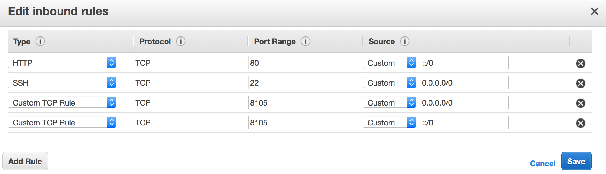

1. Click Review and Launch.

1. Launch.

1. Select or make key-pair and download.  
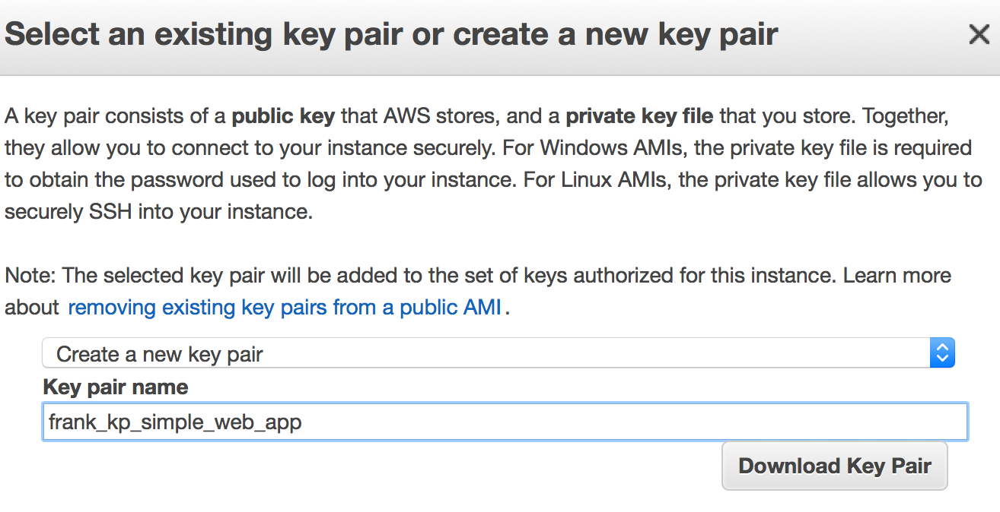

1. Launch the instance.

1. Verify that the instance is launched.  
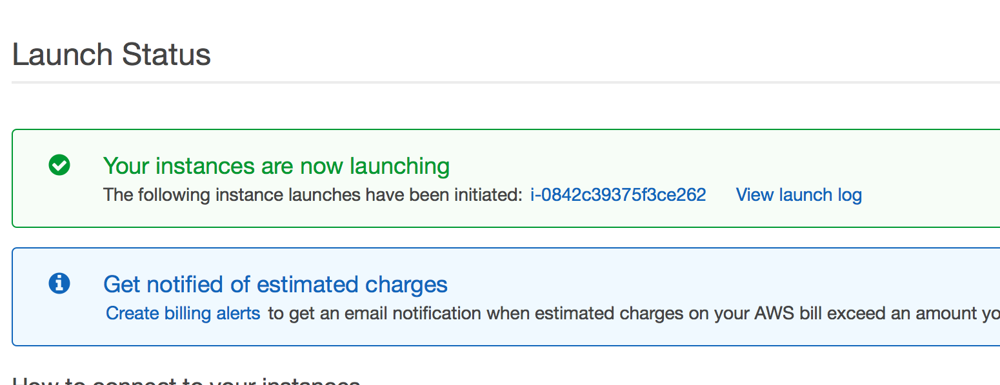

1. ssh into the instance. (See your AWS lecture notes if you don't remember how.)

1. Clone your web app on Github.  
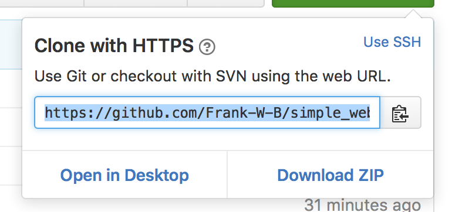

1. Clone it into your EC2 instance.

1. Modify your flask app's port to be consistent with the port you specified in your instance, and add threading.
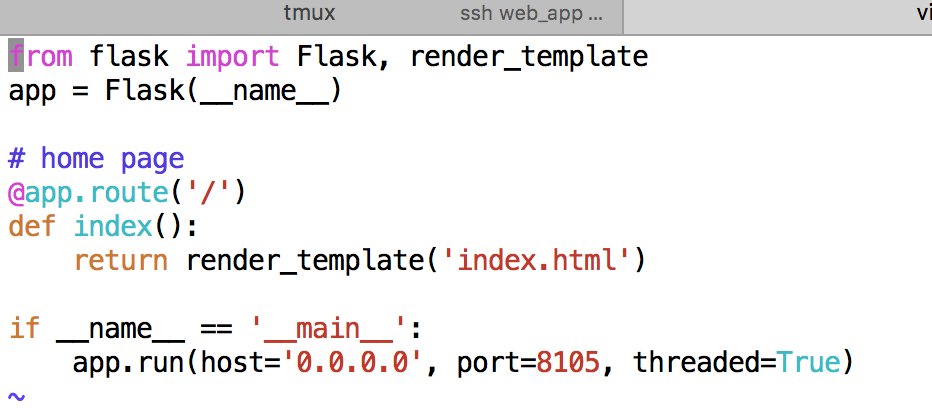

1. Start a `tmux` or `screen` session (look as AWS notes if you don't remember how.)

1. Now run your app in the tmux or screen session.  
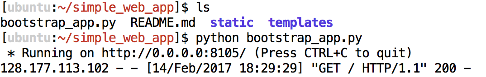

1. Detach (but leave running) your tmux session by hitting Ctrl-b d, or screen session by Ctrl-a d.

1. Our site, finally, should be deployed!  
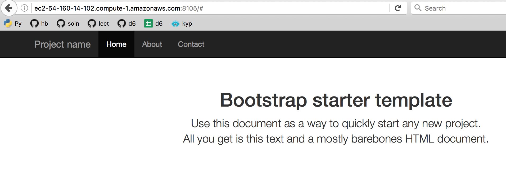

Not hard, right?

Now you can customize by adding and altering html templates in the templates folder.

