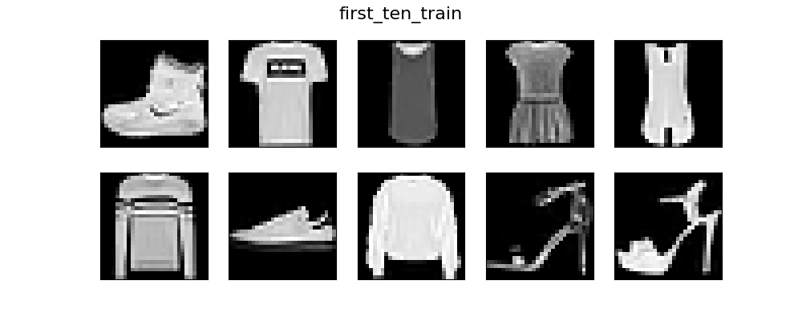
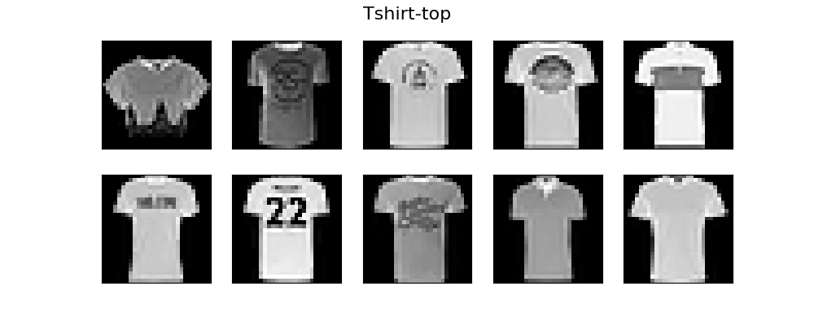
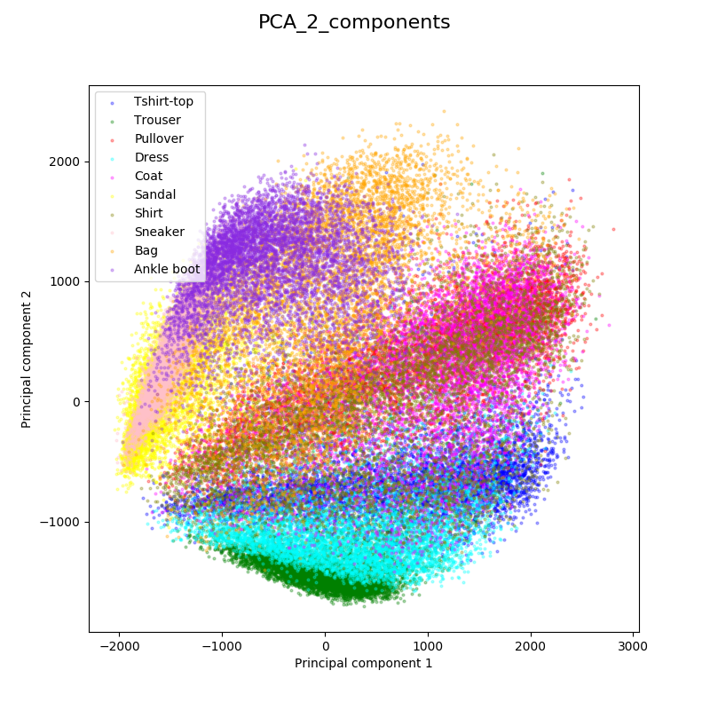
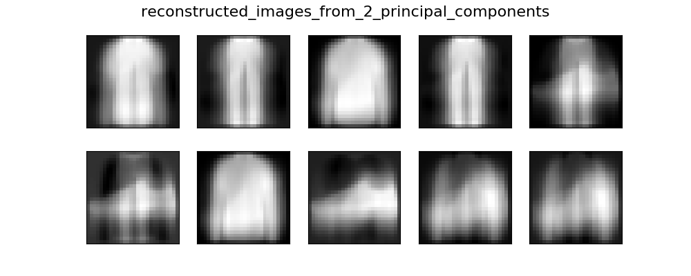
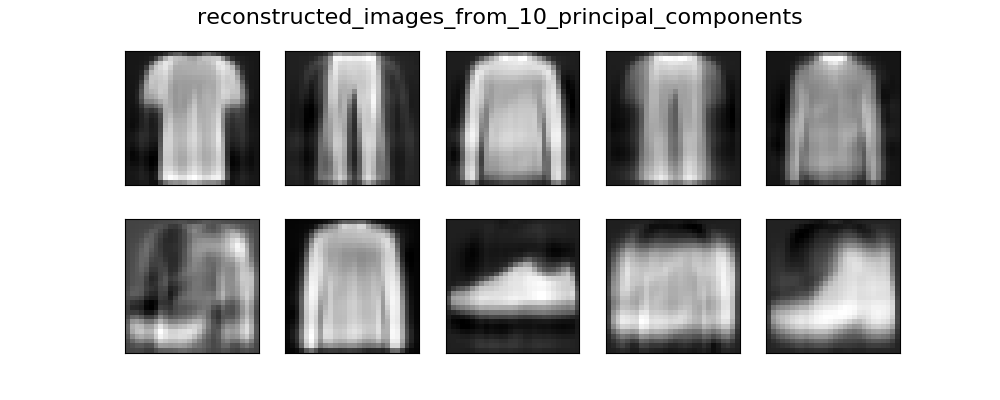
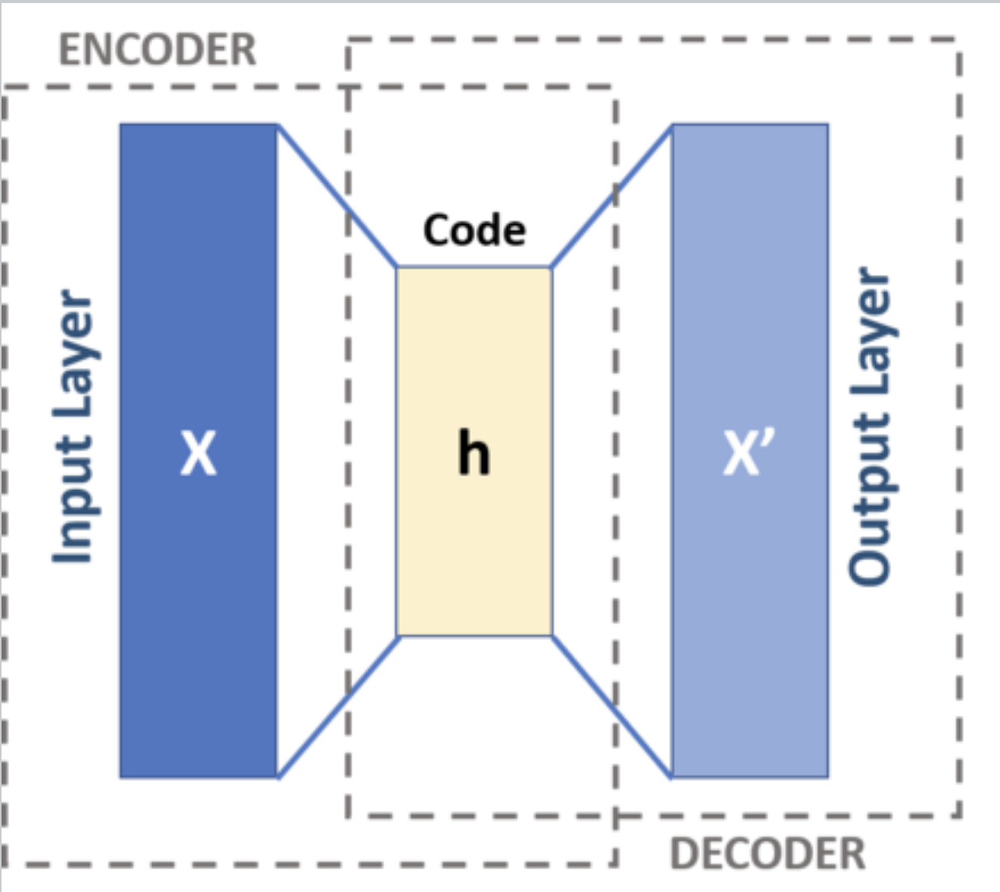
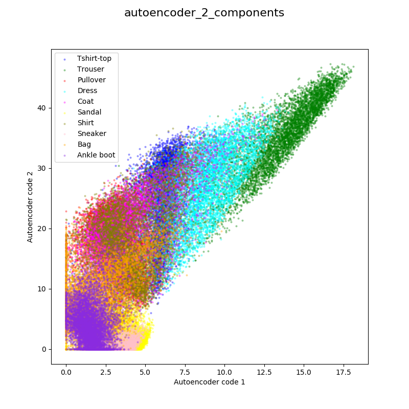
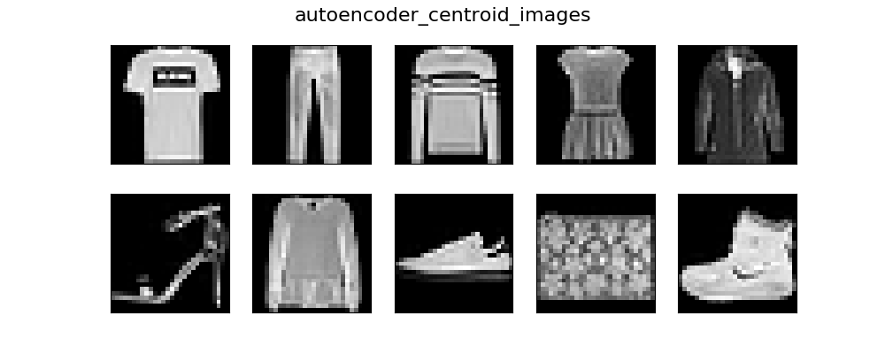
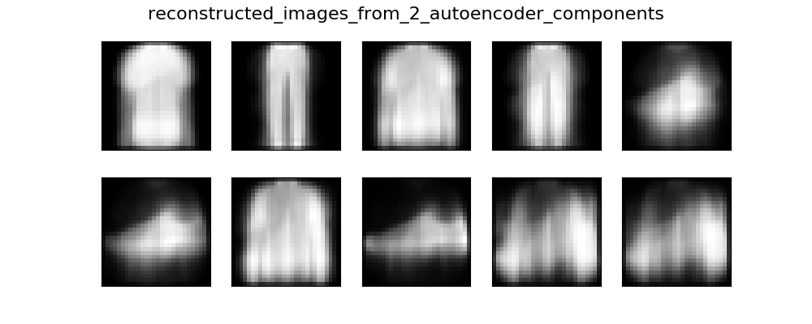

## Autoencoder assignment

You're been tasked with making a content-based clothing recommender.  You'd like 
to include information about how the clothing looks in your data, but you can't
use the native images.  You'll need to use dimensionality reduction to
featurize the images into row vectors to add to other features describing the 
clothing in your X matrix.

We've introduced you to several methods for dimensionality reduction.  Autoencoders
are yet another way. In this assignment you'll be comparing dimension reduction 
results on images from PCA with results from a linear autoencoder. 

The clothing images are in the [Fashion MNIST](https://github.com/zalandoresearch/fashion-mnist) 
dataset. Like MNIST, the images are grayscale, low-resolution (28 x 28 pixel),
and one of 10 categories. There are 70,000 images total (60,000 train, 10,000 test)
distributed equally amongst the classes. 

Here are the category labels:

| Label | Description |
| --- | --- |
| 0 | T-shirt/top |
| 1 | Trouser |
| 2 | Pullover |
| 3 | Dress |
| 4 | Coat |
| 5 | Sandal |
| 6 | Shirt |
| 7 | Sneaker |
| 8 | Bag |
| 9 | Ankle boot |  

1. Tensorflow includes the Fashion MNIST dataset.  Read it in using:  
   ```python
   import tensorflow as tf
   from tensorflow import keras

   if __name__ == '__main__':
       fashion_mnist = keras.datasets.fashion_mnist
       (train_images, train_labels), (test_images, test_labels) = fashion_mnist.load_data()
   ```
   Going forward, restrict yourself to using only train_images and train_labels.

2. Write a function, `plot_images_in_lst(image_lst, fig_name)` that will plot 
   each image provided in the image list in one figure and [save the figure to a 
   filename](https://matplotlib.org/3.1.1/api/_as_gen/matplotlib.pyplot.savefig.html) 
   specified by fig_name.  Choose a suitable [colormap](https://matplotlib.org/3.1.0/tutorials/colors/colormaps.html) for grayscale images and [set it when you plot the image](https://chrisalbon.com/python/basics/set_the_color_of_a_matplotlib/).  
   
   Say you wanted to plot the first ten train images.  You would populate the image
   list and specify the filename to save the figure using  
   ```python
   fig_name = 'first_ten_train.png'
   image_lst = [train_images[i] for i in range(0, 10)]
   plot_images_in_lst(image_lst, fig_name)
   ```
   You should get something like this:  
   

3. Make a dictionary that relates the label integers 0-9 to the clothing
   description provided in the table above.  Use this dictionary, your
   `plot_images_in_lst` function, train_images masked by the train_labels,
   and a random seed to plot and save 10 randomly selected images from
   each category.
   
   For the 'Tshirt/top' category you might get something like this:  
   

4. The data need to be flattened to row vectors: 28 x 28 to 784.  If we 
   were using a convolutional autoencoder then we would leave the data for the
   autoencoders as images.  However, convolutional autoencoders are expensive to 
   train.  At the end of the assignment you'll be given resources to attempt a
   convolutional autoencoder at a later date (perhaps for a capstone.)

## PCA
5. Look for structure in the images using PCA. Use only 2 components in your PCA
   and plot all the training data where each datapoint is colored and labeled by 
   the clothing category it belongs to.

   You result should be similar to this:  
     

   In this reduced dimensional space, what categories are most similar to the 
   'Dress' category?  What category do you think is most the most difficult to 
   distinguish from the other categories in this plot?

6. In this reduced dimensional space, find the most representive image for each category.
   A defensible way to do this is, for each category, find the average value for each principal
   component (the centroid) and then find the image in that category nearest the centroid.
   Once you find them, plot their untransformed version.

   Our result:   
    

7. In PCA the number of principal components is usually selected based on explaining some
   desired proportion of the variance in the data (90% rule-of-thumb.)  Here we chose
   two for visualization purposes.  For a recommender we'd probably like more than just two.  
   But a reasonable question is how much of each image is preserved by just the two principal
   components we selected? 

   Use sklearn's PCA [inverse_transform](https://scikit-learn.org/stable/modules/generated/sklearn.decomposition.PCA.html#sklearn.decomposition.PCA.inverse_transform) to take the 
   two component PCA representations of the representative centroid images and 
   transform them back into 784 features, and then reshape the images into 28x28 
   pixel images and plot them.

   Our result using only 2 principal components (47% of the variance):  
    

   Our result using 10 principal components (72% of the variance):  
    

## Autoencoder
Let's use an autoencoder to perform the dimensionality reduction instead. 
As stated by Wikipedia:
> An autoencoder is a neural network that learns to copy its input to its output. It has an internal (hidden) layer that describes a code used to represent the input, and it is constituted by two main parts: an encoder that maps the input into the code, and a decoder that maps the code to a reconstruction of the original input.   
 
    
 
 source: [Wikipedia](https://en.wikipedia.org/wiki/Autoencoder)

8. The simplest autoencoder architecture that we could compare directly to 
   2 component PCA would be an input layer consisting of 784 inputs squeezed down 
   to a "code" layer of only 2 values then back to an output layer of 784
   values identical to the input values.  [Using guidance from this blog](https://rubikscode.net/2018/11/26/3-ways-to-implement-autoencoders-with-tensorflow-and-python/), implement this
   architecture.  The blog shows 3 ways to implement an autoencoder architecture in Tensorflow 2 - 
   use the 2nd way (Keras Autoencoder). Feel free to modify it as you see fit. 

   This blog uses Keras's [Functional API](https://keras.io/getting-started/functional-api-guide/) 
   instead of the [Sequential API](https://keras.io/getting-started/sequential-model-guide/).  The
   Functional API is meant to be more flexible and for more complex models (you don't need it
   for a linear autoencoder, though.)
   
   Note the code as-is encodes the image down to 32 values, not 2.  Where are these 32 values
   stored, and how can you access them?  
   
   Also, some hyperparameter tuning is required to get better than white noise in the reconstructed images from the supplied code.  You shouldn't need more layers.

9. Once your 784 -> 32 -> 784 autoencoder is giving you decent reconstructions in the supplied
   code, try 784 -> 2 -> 784 and look at the reconstructions.  Now that you've reduced the 
   dimensions to just two, you can plot them (like you did with PCA).  Make sure you've encoded the
   training images (the provided code encodes x_test), and plot them.  

   Here's what we get.  Your results may vary.  
     

10. As before, find the most representative image from each category and plot them.

    Our results:  
     

    There's a remarkable similarity of these to those obtained from PCA.  
    
11. As you did with PCA, reconstruct each of these images from the low dimensional 
    encoded version. 

    Heres what we get:  
     

   The quality of the reconstruction is arguably the same as PCA.  This might get you 
   thinking that the results of PCA and linear autoencoders are similar, and you'd 
   [be right](https://medium.com/analytics-vidhya/journey-from-principle-component-analysis-to-autoencoders-e60d066f191a) as long as you
   used linear activations in the autoencoder.

   If you are set on getting better performance of out only 2 encoded features, you might try
   more encoding and decoding layers (with nonlinear activations).  Additionally you could
   try a Convolutional Autoencoder - it's the last architecture mentioned in the [blog.](https://rubikscode.net/2018/11/26/3-ways-to-implement-autoencoders-with-tensorflow-and-python/)
