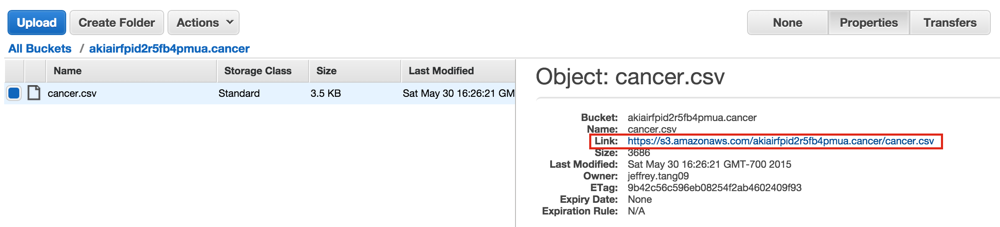

## Part 1: S3 on AWS

S3 is the storage system on AWS. Here, you will practice interacting with it via the Amazon GUI
and with the Python library `boto3`. You should know how to read and write files to S3 using a
python script at the end of this exercise.

<br>

1. Log into your [Amazon account](http://aws.amazon.com/console/), and create an S3 bucket using the GUI.
   **The bucket name must be globally unique (not used on any AWS account).**

   [Rules for S3 Bucket Names](http://docs.aws.amazon.com/AmazonS3/latest/dev/BucketRestrictions.html):
   * Bucket names must be at least 3 and no more than 63 characters long.
   * Bucket names can contain lowercase letters, numbers, and hyphens.
   * Periods are allowed but can cause problems. Avoid using periods.
   * Bucket names cannot start or end with a hyphen or period.


2. Upload (using the GUI) `data/cancer.csv` to your bucket, and note the link to the file.

   


3. Use `boto3` to read in the file from S3.   There are helpful boto3 [examples here](https://boto3.amazonaws.com/v1/documentation/api/latest/guide/s3-examples.html).

4. Compute the rates of cancer for each row, and make a histogram of the rates. Save the histogram as a `.png`
   file using `savefig` in matplotlib. Save a `.csv` file of the rates you use for the histogram as well.

5. Write a script using `boto3` to upload the histogram `.png` and the rates `.csv` to the bucket you have created.
   Confirm you have uploaded the files by checking the GUI console.


<br>

## Part 2: EC2 on AWS

EC2 is a remote virtual machine that runs programs much like your local machine. Here you will learn how to
run tasks on an EC2 machine. Most EC2 instances come without a lot of the packages you need. Here, we will use
an instance that has most of the data science packages installed.

<br>

1. Create an EC2 instance. Search for a Machine Image (Community AMI) that has `anaconda3` and `Ubuntu`. **Optional - you could choose only Ubuntu as the AMI and then build your instance with anaconda3 from the ground up.  See directions at the end of this guide.** Choose `t2.micro` for the instance type. Give the instance an IAM role that allows it full access to S3. Choose an *all-lowercase* name for the instance and add a `Name` tag (Key=`Name`, Value=`examplename`). Careful: Do not replace `Name` in the key field. Set the value instead by replacing `examplename`.
  
2. Log into the instance you have launched using `ssh`. 

3. Update `apt` sources and perform routine updates:

```
sudo apt update
sudo apt upgrade
```

4. Modify the script you have written to process `cancer.csv` in `Part 1`. Instead of writing the results to
   the same S3 bucket as where `cancer.csv` is, change the script to write to a new bucket.  

   You will have to modify the script in another way, because EC2 linux servers don't have the same visual resources as your laptop.  Therefore, you'll need to change how you import `matplotlib.`  Modify the import in your script:
   ```python
   import matplotlib
   matplotlib.use("Agg")
   import matplotlib.pyplot as plt
   ```
5. Use `scp` or `git` to copy the script onto the EC2 instance.
   
6. Run the script on the EC2 instance and check S3 to make sure the results are transferred to a new bucket. In practice, you will be testing the script locally with a smaller subset of the data, and run the script on the whole set on EC2. If your task requires more processing power, you have the option to run it on a more powerful EC2 instance with more RAM and more cores.


**Optional (if you didn't use an anaconda3 AMI)**

Install Anaconda

```
# Download Anaconda3
wget -S -T 10 -t 5 https://repo.continuum.io/archive/Anaconda3-5.0.1-Linux-x86_64.sh -O $HOME/anaconda.sh

# Install Anaconda
bash anaconda.sh

# when prompted for an installation path, 
# press "enter" to accpet the default


# when prompted to "prepend the install location 
# to your PATH", type 'yes'

# once installation is finished, you still have
# to execute the commands in ~/.bashrc
source ~/.bashrc

conda install boto3
```
