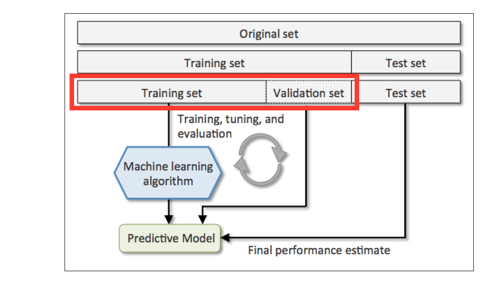

## Cross Validation

## Introduction
The goal of any model-building process is to increase the predictive performance of a statistical model. Today you'll learn the difference between a training set, test set, validation set and a process known as cross-validation - and ultimately how these varying methods have a direct effect on your models predictive performance on unseen data.

Since we normally only have access to a fixed data set, it's common to split the original data set into two portions named a **train** and **test** set - of which we'll use the test portion to simulate 'unseen data.'

How we deal with the **train** portion of the original data set will be the focus of this mornings sprint. Below are four different ways to build upon the complexity of our training strategy to produce the best process for training and validating our models.

- **Worst Option** - Train model with original data set without splitting into train and test set. Unable to score our model and determine its predictive performance since we don't have test set.
- **Bad Option** - Only perform a train-test split. Train model with entire training set and score against test set.
- **Better Option** - Further split training set into **one** smaller training set and **one** validation set. Use validation set score to guide our model choice and then score best model against test set. *Below is an image of this option.*
- **Even Better Option** - Cross validate training set by splitting into **many** training sets and **many** validation sets. Rotate through each portion to build and validate model and average results. Best model is used to score against test set.

<div align="center">
    
</div>

- **Training Set** - Used to train one, or more, models.
- **Validation Set** - Used to tune hyperparameters of different models and choose the best performing model.
- **Test Set** - Used to test the predictive performance of the best scoring model.

## Basic

### Part 1: Load and Split Data
**Note: Put your code in `cross_val.py` for submission.**

1. Include the following lines to import the libraries needed:

   ```python
   from sklearn.neighbors import KNeighborsRegressor
   from sklearn.model_selection import KFold
   from sklearn.model_selection import train_test_split
   from sklearn.model_selection import cross_val_score
   import numpy as np
   from sklearn.datasets import load_boston
   ```

2. Load in the boston data with the following commands.

   ```python
   boston = load_boston()
   X = boston.data # housing features
   y = boston.target # housing prices
   ```

   Descriptions for each column in feature matrix `X`:

   ```
   Attribute Information (in order):
    - CRIM     per capita crime rate by town
    - ZN       proportion of residential land zoned for lots over 25,000 sq.ft.
    - INDUS    proportion of non-retail business acres per town
    - CHAS     Charles River dummy variable (= 1 if tract bounds river; 0 otherwise)
    - NOX      nitric oxides concentration (parts per 10 million)
    - RM       average number of rooms per dwelling
    - AGE      proportion of owner-occupied units built prior to 1940
    - DIS      weighted distances to five Boston employment centers
    - RAD      index of accessibility to radial highways
    - TAX      full-value property-tax rate per $10,000
    - PTRATIO  pupil-teacher ratio by town
    - B        1000(Bk - 0.63)^2 where Bk is the proportion of African-American residents by town
    - LSTAT    % lower status of the population
   ```

3. Use `train_test_split()` in scikit learn to make a training and test dataset.
   There is no rule on train-test splits.  Below we use a 75 : 25 split.

   ```python
   X_train, X_test, y_train, y_test = train_test_split(X, y, test_size=0.25)
   ```


### Part 2: Train and Test Split Only (Bad Option)
The reason this option is considered a poor chioce is two-fold: 1) High Variance - The split into a train and test set could randomly be such that the training set is not representative of the test set. This could mean our estimate of the performance of our model is wrong because the test set is unlike other data we will see. 2) No validation set for model tuning -- If we want to iterate on our model (for hyper-parameter optimization, or variable selection) on the basis of its test-set performance we can use the test set for this purpose, but without a validation set, we can't get an estimate of how our model will perform on truly unseen data, because the model has been able to "see" the test set. As a result estimates of the performance of the model are likely to be _optimistic_ when calculated based on training data for which the model has been selected to perform as well as possible.

1. Since we already split the original data set on Part 1, we'll train our model on the training set only. 

2. Write a function `rmse(true, predicted)` that takes your `true` and `predicted` values and calculates
   the RMSE. You should use `sklearn.metrics.mean_squared_error()` to confirm your
   results.

3. Use `KNeighborsRegressor()` in scikit-learn to build a model with your training data.

   Note that this is a complicated dataset with a good deal of correlation.  You might consider

   ```python
   # Fit your model using the training set
   reg = KNeighborsRegressor()
   reg.fit(X_train, y_train)

   # Call predict to get the predicted values for training and test set
   train_predicted = reg.predict(X_train)
   test_predicted = reg.predict(X_test)

   # Calculate RMSE for training and test set
   print( 'RMSE for training set ', rmse() )
   print( 'RMSE for test set ', rmse() )
   ```
4. Which RMSE did you expect to be higher?

5. Explain the value of evaluating RMSE on a separate test set (instead of fitting a
   model and calculating RMSE on the entire data set).

## Advanced

### Part 3: K-fold Cross Validation (Even Better Option)
In K-fold cross validation, we'll split our training set into **k** groups, usually 5 or 10. One of the k groups will act as our validation set, the rest of the (**k-1**) groups will be the training set. We'll iterate through each combination until each **fold** has had a chance to act as our validation set. At each iteration, a metric for accuracy (RMSE in this case) will be calculated and an average score will be calculated across the k iterations.

<div align="center">
    
</div>

<br>

1. Create the function `crossVal(X_train, y_train, k)` using K-fold validation **on the training dataset**. `sklearn` has its own implementation of K-fold (`sklearn.cross_validation.cross_val_score()`). However, to develop your understanding of K-fold, you will implement it here. Your own implementation should:

   A) Randomly split the dataset into **k** folds.  You may use sklearn's `KFold` class if you'd like.

   B) For each fold:
    1. train the model with the (k-1) _other_ folds,
    2. use the trained model to predict the target values of each example in the current fold,
    3. calculate the RMSE of the current fold's predicted values,
    4. store the RMSE for this fold.

   C) Average the **k** results of your error metric. Return the average error metric.

2. Use the code you just wrote to compute the k-fold cross validation score on the training set. (use k=5 and train a KNN Regression model on the Boston data). How does this compare to the RMSE score you just computed for your **test set** from Part 2?

3. To get a feel for how the size of the training set affects performance, do k-fold cross validation where you limit the training set size by varying amounts. Plot the learning curve (MSE in this case) across varying training set sizes. (You might want to use: [cross_val_score](http://scikit-learn.org/stable/modules/generated/sklearn.model_selection.cross_val_score.html) which is scikit-learn's built-in function for K-fold cross validation.)


## Extra Credit

### Part 4: Stepwise Regression
While stepwise regression has its many [critics](http://andrewgelman.com/2014/06/02/hate-stepwise-regression/), it is a useful exercise to introduce the concept of feature selection in the context of regression. It is typically thought of in the context of linear regression, but can be useful with KNN to combat the curse of dimensionality.

1. Generate a series of of `n=5000` samples, `n=100` features, with a `random_seed=0` using the `make_friedman1` dataset [like so](http://scikit-learn.org/stable/modules/generated/sklearn.datasets.make_friedman1.html):

    ```python
    from sklearn.datasets import make_friedman1
    X_fri, y_fri = make_friedman1(n_samples=5000, n_features=100, random_state=0)
    ```

<b>N.B.</b> - We're going to be doing a brute force search in the next few steps.  You might want to start with a set with only 10 features, tune your code, then circle back to having the fully robust set.

2. We're going to implement a brute force approach to Recursive Feature elimination.  When we cover linear regression, we can discuss more effective ways than the approach we will try right now.  To implement this approach, we're going to write a function ```Eliminate_One``` (see the below doc string for parameter definitions).  The function is going to try *every* subset of the original feature set that is of size n-1.  For example if I'm passing in the array ```[1, 4, 6]``` into the function, I'm indicating that the previous step identified columns 1, 4, and 6 as the best possible combination of three features.  I should then try to fit and evaluate a model with combinations of ```[1,4], [1,6], [4,6]```.

```python
def Eliminate_One(reg, X, y, included_features):
    '''
    Eliminate One
    For a provided regressor, evaluate the ideal subset of n-1 features to try from 
    a provided list of n features.  This function can be called itterative to perform
    recursive feature elimination for a general regression model (not leveraging feature
    importances).
    
    Inputs - 
    * reg = a regression model matching the sklearn mechanics
    * X, y = numpy arrays for the features and targets
    * included_features = numpy array indicating the column indexes to subset from
    '''
```

3. Using a `for` loop, generate a series of models that take the top `n` features and calculate the `R^2` score using the `.score()` method. 

4. Plot the *Adjusted* `R^2` as a function of the number of included features. What does this plot tell you about the number of useful features in your model?
