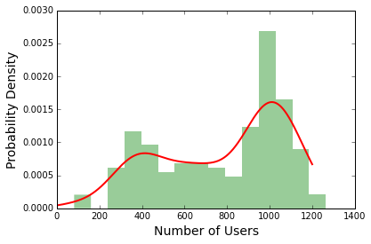
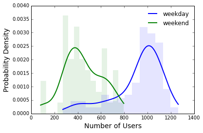
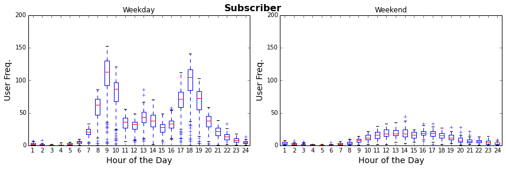
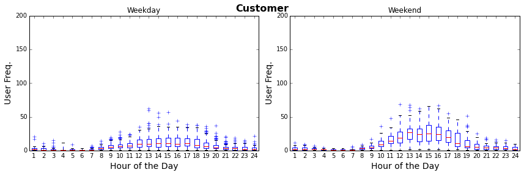

# Exploratory Data Analysis and Linear Regression

## Basic

### Part 1: Exploratory Data Analysis (EDA)

Exploratory data analysis is a first crucial step to building predictive models from your data. EDA allows you
to confirm or invalidate some of the assumptions you are making about your data and understand relationships between your variables.
 
<br>
 
In this scenario, you are a data scientist at Bay Area Bike Share. Your task
is to provide insights on bike user activity and behavior to the products team. 


1. Load the file `data/201402_trip_data.csv` into a dataframe. Provide the argument `parse_dates=['start_date', 'end_date']`
   with `pandas.read_csv()` to read the columns in as datetime objects. 
   
   Make 4 extra columns from the `start_date` column (We will use these in later questions):
   - `month` would contain only the month component
   - `dayofweek` would indicate what day of the week the date is
   - `date` would contain only the date component 
   - `hour` would only contain the hour component
   - [Hint to deal with datetime objects in pandas](http://stackoverflow.com/questions/25129144/pandas-return-hour-from-datetime-column-directly)

2. Group the bike rides by `month` and count the number of trips per month. Plot the number of trips for each month. 
   What do you observe? Provide a likely explanation to your observation. Real life data can often be messy/incomplete
   and cursory EDA is often able to reveal that.
   
3. Plot the daily trip count from September to December. Mark the `mean` and `mean +/- 1.5 * Standard Deviation` as 
   horizontal lines on the plot. This would help you identify the outliers in your data. Describe your observations. 
   
   

4. Plot the distribution of the daily trip counts for all months as a histogram. Fit a 
   [KDE](http://glowingpython.blogspot.com/2012/08/kernel-density-estimation-with-scipy.html) to the histogram.
   What is the distribution and explain why the distribution might be shaped as such. 
    
   
  
   Re-plot the distribution of daily trip counts after binning them into weekday or weekend rides. Refit  
   KDEs onto the weekday and weekend histograms. Here days greater than 4 are weekends.
   
   

5. Now we are going to explore hourly trends of user activity. Group the bike rides by `date` and `hour` and count 
   the number of rides in the given hour on the given date. Make a 
   [boxplot](http://blog.bharatbhole.com/creating-boxplots-with-matplotlib/) of the hours in the day **(x)** against
   the number of users **(y)** in that given hour. 
   
6. Someone from the analytics team made a line plot (_right_) that he claims is showing the same information as your
   boxplot (_left_). What information can you gain from the boxplot that is missing in the line plot?
   
   

7. Replot the boxplot in `6.` after binning your data into weekday and weekend. Describe the differences you observe
   between hour user activity between weekday and weekend? 
    
8. There are two types of bike users (specified by column `Subscription Type`: `Subscriber` and `Customer`. Given this
   information and the weekend and weekday categorization, plot and inspect the user activity trends. Suppose the 
   product team wants to run a promotional campaign, what are your suggestions in terms of who the promotion should 
   apply to and when it should apply for the campaign to be effective?
   
   
   
   
9. **Extra Credit:** You are also interested in identifying stations with low usage. Load the csv file 
   `data/201402_station_data.csv` into a dataframe. The `docksize` column specifies how many bikes the station can hold. 
   The `lat` and `long` columns specify the latitude and longitude of the station. 
   
   - Merge the station data with the trip data
   - Compute usage by counting the total trips starting at a particular station divided by the dockcount
   - Normalize usage to range from `0`to `1`
   - Plot the latitude and longitude of the stations as scatter points. Encode usage information in the size of the points in the scatterplot.  

## Advanced

### Part 2: Intro to Linear Regression
Linear regression is an approach to modeling the relationship between a continuous dependent (**y**) variable and 
one or more continuous independent (**x**) variables. Here you will be introduced to fitting the model and connecting the results to 
the interpretation of data.  We will continue to look at other aspects of regression analysis in future sprints.

1. We will be using the `prestige` dataset. Load the data with the following code. **Remember to add a column of `1's` to the x matrix for the 
   model to fit an intercept**.

   ```python 
   import pandas as pd
   url = 'https://raw.githubusercontent.com/vincentarelbundock/Rdatasets/master/csv/carData/Duncan.csv'
   prestige = pd.read_csv(url)
   y = prestige['prestige'].values
   x = prestige[['income', 'education']].values
   ```

2. Explore the data by making a [scatter_matrix](http://pandas.pydata.org/pandas-docs/version/0.15.0/visualization.html#visualization-scatter-matrix)
   and a [boxplot](http://pandas.pydata.org/pandas-docs/stable/generated/pandas.DataFrame.boxplot.html)
   to show the range of each of your variables.
   
3. The beta coefficients of a linear regression model can be calculated by solving the **normal equation**.
   Using numpy, write a function that solves the **normal equation** (below).
   As input your function should take a matrix of features (**x**) and
   a vector of target (**y**). You should return a vector of beta coefficients 
   that represent the line of best fit which minimizes the residual. 
   Calculate  R<sup>2</sup>. 
   
   <div align="center">
      
   </div>

   Fun fact: you'll get a more precise answer if you use `np.linalg.solve` on `(X^T X) beta = X^T y` than if you invert `(X^T X)` using `np.linalg.inv`. See [here](https://stackoverflow.com/questions/31256252/why-does-numpy-linalg-solve-offer-more-precise-matrix-inversions-than-numpy-li) for more info.
   
3. Verify your results using statsmodels. Use the code below as a reference.
   ```python
   import statsmodels.api as sms
   model = sms.OLS(y, x).fit()
   summary = model.summary()
   ```

4. Interpret your result summary, focusing on the beta coefficients and the R<sup>2</sup>. 
