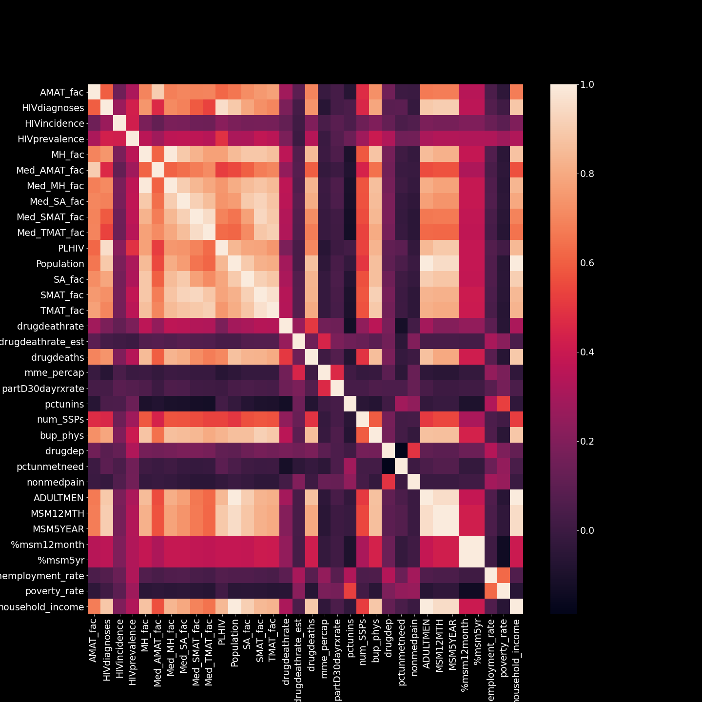

## Forecasting-HIV-Infections Case Study

# Our Goals
 - To accurately model HIV incidences (new infections per 100,000) in US counties by building a linear regression model that utilizes HIV infection data, census data, data on the opioid crisis, and data on sexual orientation.

 - Identify features that are the most significant drivers of HIV infection rates and learn how these drivers differ between different regions (MVP+)

# Background

Due to the development of anti-retroviral therapies the HIV/AIDS epidemic is generally considered to be under control in the US. However, as of 2015 there were 971,524 people living with diagnosed HIV in the US with an estimation of 37,600 new HIV diagnoses in 2014. HIV infection rates continue to be particularly problematic in communities of color, among men who have sex with men (MSM), the transgender community, and other vulnerable populations in the US. Socioeconomic factors are a significant risk factor for HIV infection and likely contribute to HIV infection risk in these communities. The current US opioid crisis has further complicated the efforts to combat HIV with HIV infection outbreaks now hitting regions that weren’t previously thought to be vulnerable to such outbreaks.

A model that can accurately forecast regional HIV infection rates would be beneficial to local public health officials. Provided with this information, these officials will be able to better marshal the resources necessary to combat HIV and prevent outbreaks from occurring. Accurate modeling will also identify risk factors for communities with high HIV infection rates and provide clues as to how officials may better combat HIV in their respective communities.

# Data Cleaning 
We initially used the merge_data.ipynb file provided to us and created the hiv_data_pipeline.py file to create a pipeline to pull the data into another file. 

We then took a look at the resulting dataframe that included columns such as County, HIV Diagnosis rate, HIV incidence rate, HIV prevalence rate, drug death rates, population of the county, and various other possible HIV predictors.

We decided in order to identify the features of the data that were the most significant drivers of the HIV incidence rate, we removed the following columns: 
   - County Code
   - County
   - State Abbreviation
   - Year

# EDA

To help aid us in feature selection, we created a table of correlation values. We wanted to see which features may be colinear and how strongly they're correlated to our target (HIV_Incidence). Here's the heatmap of the correlations:

We used the correlation matrix in order to make the choice to remove the features:
   
   'ADULTMEN', 'PLHIV', 'Population', 'Med_AMAT_fac', 'MSM12MTH', 'MSM5YEAR', '%msm5yr', 'TMAT_fac', 'MH_fac', 'Med_MH_fac', 'Med_TMAT_fac', 'SA_fac'

We also created scatter plots of all the features with the feature and the target to visualize the correlation. Here are a few plots:

We also found that there was a strong outlier in the data: Scott County in Indiana had an Incidence Rate of 771.4. Since we don't have the ability to verify this datapoint, we decided to do the analysis with the outlier included and excluded from the dataset. 

After removing 

# Analysis

In order to use a Linear Regression model there are a few assumptions: 
1. Linearity: the relationship between the X and the y can be modeled linearly
2. Independence: the residuals should be independent from each other
3. Normality: the residuals are normally distributed
4. Homoscedasticity: the variance of the residuals is constant
5. No multicollinearity: the independent variables are not highly correlated with each other

To justify the usage of this model on the HIV data, we need to verify that these assumptions are true. 

The feature engineering, choosing which features to use in our model is another essential part of the Analysis process. 

# Results

We compared the performance of our model before and removing the Scott county outlier. There was a significant improvement in the model as a result of the removal of this single observation

We found the features that were the most important were:

    HIV diagnosis, HIV prevalence, MED_SMAT_fac, drug death rate, drug deaths, PCTUNINS, BUPPHYS, poverty rate, household income
    
# Data Sources
The ./data folder contains data from three publically available sources.

 - The largest collection of HIV and opioid data was obtained from the opioid database maintained by the American Foundation for AIDS Research (amfAR).
 - Demographic and economic data were obtained from the 5yr - American Community Survey which are available at the US census bureau website.
 - Estimates for the MSM population in each county were obtained from the Emory Coalition for Applied Modeling for Prevention (CAMP).

Future Work: 

Re-fit model with the following columns dropped:

    AMAT_fac, Med_SA_fac, SMAT_fac, num_SSPs, 'drugdep',
    'pctunmetneed', 'nonmedpain', '%msm12month', 'unemployment_rate'
TODO:

clean data: make all columns lower case

feature slection: remove collinear features, use lasso L1 for feature selection use regularization (standardize each collumn)

plot a histogram of target

if we're going to standardize the data,

train_test_split

k-fold cross validation

use lasso for feature selection

prevalence - The percentage of people who were tested that were found to be HIV positive, this is dependent on population

incidence - The number of new HIV infections in a population during a certain time period (yeaR)