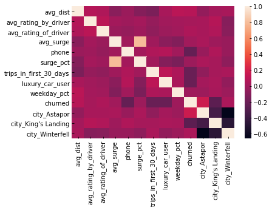
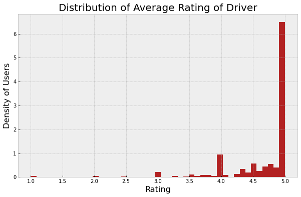
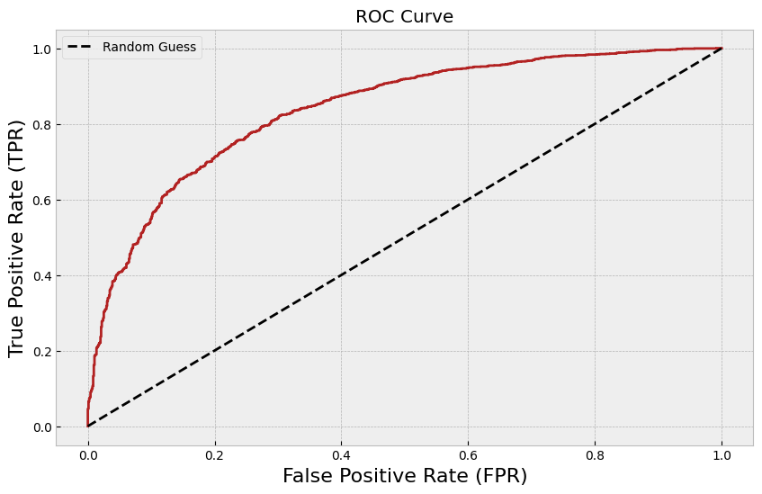
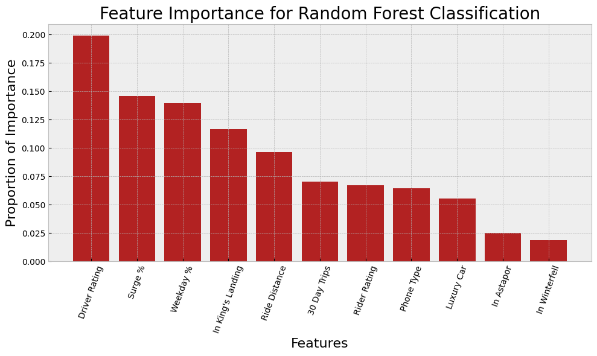
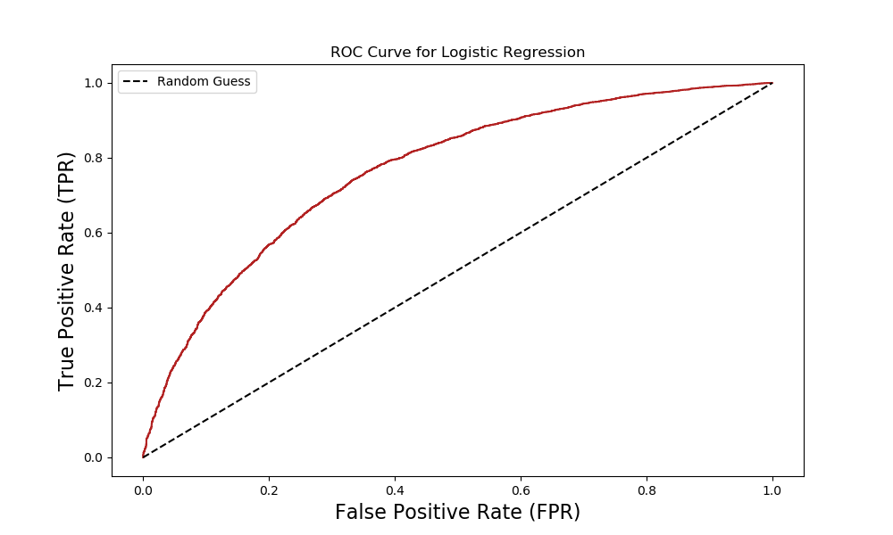
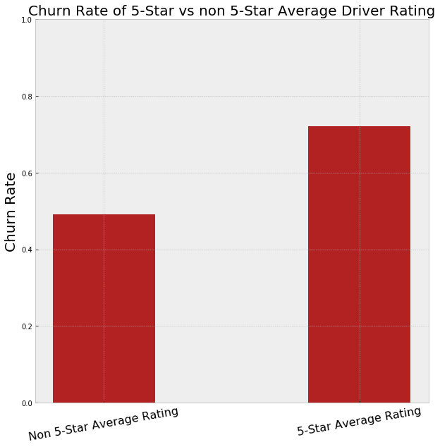

# CHURN BABY CHURN - A Disco Inference-o

## Background and Motivation
What are the factors causing customers to leave our ride share service? Can we predict the churn going forward, and how can we adjust our business approach to reduce this churn and retain more customers?

## Data Cleaning

### Preliminary
Our preliminary cleaning consisted of:
- Extracting our target - churn - as of July 1st, from the last_trip_date (which we subsequently dropped)
- Scaling the Percentages in `weekday_pct` and `surge_pct` features, which were in 0-100 percent format, to rate values between 0 and 1.
- Converted the `phone` data to a boolean representing iPhone vs Android. 
- One-hot encoded the `city` feature (King's Landing, Astapor, and Winterfell).
- Converting the dates to a datetime format.
- Converting booleans into 0/1 representation.

## EDA

### Hunches

Looking at the data, we had a few preliminary guesses on important features.

 - Lower average ratings, whether from the driver or rider, would suggest a poorer ride experience. 
 - A high drive distance might indicate a one time trip to a special location, rather than a regular use somewhere inter-city.
 - If a customer is frequently paying a surge price, that price-point might discourage them from continuing (even in non-surge times).
 - Riders might have a lower number of rides if their average ratings are a whole or near whole number (discussed later)

### Feature Correlations

We began with a correlation Heatmap of Features:

Based on this graph, we decided that since there was high correlation between Surge Percentage and Average Surge, we should drop Average Surge to reduce complexity.

### Incomplete Data
There was incomplete data in the driver/rider ratings and the type of phone used, which we filled in with the following default values:
- Used the iPhone as a default phone, which were much more frequent than the Android.
- Used 5 as a default rating for drivers/rider ratings.

### Five Stars as a Default

One of our major assumptions is 5-Star as the "default" rating; riders and drivers tend to rate 5 stars for any acceptable serivce and only rate lower if there was an issue with the ride. We see that 5 star ratings are by far the most common average rating:

 Under this assumption, we felt comfortable treating missing rates as a sign that the ride was "acceptable" enough that the rider/driver had no bad experience to prompt a rating, so rating nulls were converted to 5-stars. 

## Analysis

We tried two classification models, a Logistic Regression and a Random Forest Classification.

### Random Forest Classification:
We ran a k=5 fold cross validation on a default Random Forest Classification of our data. 

We picked a somewhat high threshold (p = .75), as we thought sending an uneccesary intervention to a non-churning customer (a false positive) would be less damaging than not sending a neccesary intervention (false negative). 

The average accuracy for the training data: 0.995
The averagy accuracy for the test data: 0.753

Clearly this is overfitting. We decided that a randomized grid search was in order to find the best hyperparameters to use to tune our model. The results gave us the following: 
RandomForrestClassifier(max_features='log2', min_samples_leaf=10,
                       min_samples_split=4, random_state=1)

After re-running the cross validation with the new hyperparameters:

The average accuracy for the training data: 0.821
The average accuracy for the test data: 0.787

So our accuracy improves by .035.

We then created an ROC curve to adjust the threshold for deciding if a customer were going to churn or not:

Since we don't have an exact profit/cost function, we decided to pick a False Positive Rate of about 0.3. This gives us a threshold of about: 0.55, and re-running the training data in the model gives us a test accuracy of 0.7861.

After running the model on the holdout data, we predict out of 10,000 users, 6,298 will churn in the next 30 days. Our final accuracy on holdout data was about 0.73, a reduction of .056 from the test accuracy.

We then looked at the feature importances of this final model: 

### Logistic Regression
We also ran a Logistic Regression classification model on our data, using all our features. The test accuracy was 0.716 (with a p = .5 classification threshold), and with a ROC of the Logistic Regression:

The Logistic Regression appeared to be a weaker predictor than the Random Forest, with a shallower ROC curve and and a weaker accuracy with similiar parameters.

## Conclusions
Were any of our hunches correct? 

Features that affect churn:
Driver rating was the largest factor in churn rate. 

Other 4 top important features: Surge %, Weekday %, Kings Landing, and Ride Distance.

Our recommendations for ~~Uber~~ CompanyX:
- Driver ratings have a large impact on rider retention. Determine the root causes of poor driver ratings. They could implement some sort of survey (consult Travis) in order to get better insight. In the meantime, for customers likely to churn, only send them drivers with very high average rating.
- Implement a targeted surge pricing discount for customers likely to churn. This would be a minimally costly incentive that could have a good positive effect on retention.
- Predominantly weekday riders are more loyal to the service. Implement incentives to convert weekend-only users to more regular users - eg get them to commute by ride share!
- Longer trips result in less retention, suggesting those riders are more infrequent users - e.g. they only takes trips occasionally to and from the airport, etc. Consider some incentive for these users in their home market for shorter trips.
- Investigate the ridership in Winterfell and see if there are opportunities to expand the user base. 

## Further Work
- Impute missing values in different ways to get a better result since the ratings are in our top feature importance.
- Try a boosted trees classification to see if we can get a better model. 
- Make a cost/benefit matrix with an incentive from company. We would, of course, need the actual cost of the interventions and the (profit matrix) to do a more comphrensive analysis.

 ### Whole Number Leakage

Under 5-star default, an average driver/rider rating drops from 5 if there was an issue on _some_ ride. This is (obviously) a measure of customer satisfaction, but it's also a strong proxy of the number of rides taken; a frequent user also has many more opprotunities to get _some_ <5 trip and get some fractional average rating. So counter-intuitively, folks with _exactly_ a 5-star rating are much more likely to be infrequent users and not use the service in June. A quick comparison between 5-star rated and non 5-star rated churn rates supports this:

Riders with fractional average drivers ratings have a significantly lower churn rate (49%) than those with _exactly_ 5 stars (72%). 

The problem is average rating can be updated in June, which means that the ratings columns (and specifically if it's a fraction) is potentially a data leak that a model could put them up on. Ideally we would have the average ratings from January to May.

#### Repo Initially Forked from joshea628. Due to Forking Repo was Initially Private.
