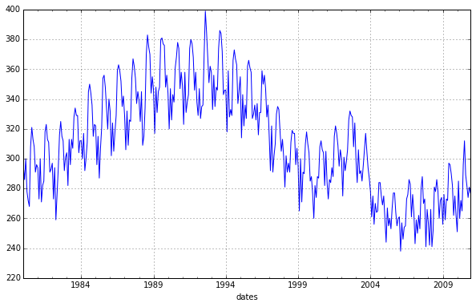
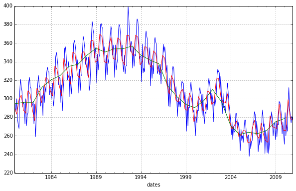

# Time series

## Basic

### Part 1: Prepare data

The number of live births (in thousands) per month in the U.S. was 
collected for the past 31 years (`data/birth.txt`) starting in January 1980 and ending
December, 2010. We will be exploring this time series using various methods and predict the birth counts for 2011.

1. Load the data into a pandas dataframe.

2. Using `pandas.date_range()` to create a `dates` variable 
   (from January 1980 and ending December, 2010).

3. Create a `time` variable (range: 1-372) to be used later in the regressions 
and both a `month` and `year` variable (use `pd.DatetimeIndex` to strip these 
values from your dates). 

4. Set the `dates` variable as the index of your dataframe.

### Part 2: Explore the data
5. Calculate some aggregated statistics by month and year. What months have 
the highest birthrates? Any intuition as to why?

6. Turn the `num_births` into a time series using `pd.Series()`.

7. Plot the overall data. What are your thoughts about the general pattern 
and or seasonal variation?

    

8. Plot the data for 2006-2010, is the seasonal pattern more apparent? 

9. Use `df.resample('Q-NOV')` to get quarterly means that follow the seasons of the year (spring, summer, fall, winter). 

10. Superimpose the yearly averages and the seasonal averages onto the monthly
data.

    

## Advanced

### Part 3: Regression model
11. Use time series regression methods to fit a model. Using `OLS` in `statsmodels`, fit the overall trend with increasing polynomial terms. 
    - You will need to take your `time` variable and create `time^2, time^3
    time^4, time^5`
    - Increase model complexity by adding a higher order term
        - Examine the summary information and compare each model to the 
          model before it (i.e. simple linear with `time` compared to 2nd order
          polynomial with `time` + `time^2`) by examining AIC/BIC.
        - Superimpose (by plotting) the fitted onto the original data and predict
          the values for 2011
        - Keep increasing until general trend has been captured 
          (You won't be able to capture the bump between 1999-2004 without a very 
          complicated model and there's no reason to assume that future values 
          wouldn't follow the more general trend) 

12. Now that you have fit trend, add in the monthly component via dummy variables to capture seasonality.  You could  also try to create a 'seasons of the year' variable and fit the quarterly time series instead of the original monthly time you plotted earlier...opportunity to play around.

13. Plot the `dates` variable (`x`) against the residuals (`y`) of the final model (including the seasonality term).
    Is there an obvious pattern of the residuals with respect to time? If there is any autocorrelation left in the 
    model, there will be some pattern in your residual and we'll learn to address that in the afternoon.

## Extra Credit

### Part 4: Decomposition

1. Implement a decomposition class with methods to estimate the trend, 
seasonality, and cyclical terms.

    -See algorithm in lecture notes to implement

2. Implement a Holt-Winter's EWMA method which will allow us to account 
for the seasonal variation.

    -See algorithm in lecture notes to implement

    
