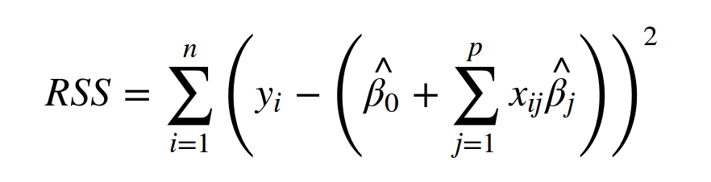
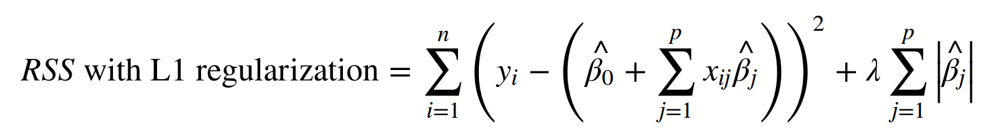
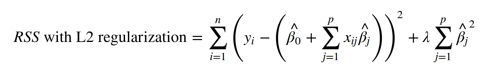
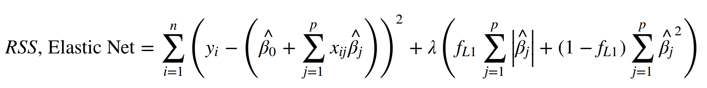

## Week 6 Review Answers

1. Write out the cost functions for:  
  * Ordinary least squares  
     

  * Linear regression using L1 regularization 

      
  * Linear regression using L2 regularization  

      
  * Linear regression using Elastic net  

      


2. You're trying to make model that will predict the female gold medal winner in the high jump in the next Olympics.  You have results and data for 1000 high-jumpers in the past.  You're using four features: `jumper_height`, `jumper_weight`, `best_jump_height`, and `fastest_100m_time` as features and your model performs ... just ok during cross-validation. Then it hits you: you also have `maximum_squat_weight` for all the jumpers, why don't you use that as a feature too?  Using this additional feature (5 total now) during cross-validation, however, you get widely varying estimates of model performance.  
  * What do you think is going on?  
   <br> An indication of an overfit model is that its predictions for test cases will vary widely when it's trained on different subsets of the training data.  Increased model complexity enables overfitting.  So in this case, whatever information was provided by adding that fifth feature was offset by the higher variance induced by the increased complexity of the model.  Besides model complexity, another reason for the higher variance is that there is much less data per feature "volume" in the 5 dimensional feature space than there was in the 4 dimensional feature space.  And so there is less information telling your model how it should fit.  

  * As a bonus, how many data points would you need with 5 features to have the same sample density as your model had with 4 features?  
  <br> N<sub>1</sub><sup>(1/d1)</sup> ~ N<sub>2</sub><sup>(1/d2)</sup>   
  1000<sup>(1/4)</sup> ~ N<sub>2</sub><sup>(1/5)</sup>  
  N<sub>2</sub> ~ 1000<sup>(5/4)</sup>  
  N2 ~ 5600 points

3. Decision tree questions:  
  * Describe, step-by-step, how a decision tree is built.  
   <br> In machine learning, decision trees are a series of sequential splitting rules on the features of data that attempt to partition the corresponding labels into homogeneous groups.  Decisions, or splits, are made at nodes on the existing data on one feature and a **splitting_value** in the range of that feature, and data and their corresponding labels flow "to the left" or "to the right" depending if their value for that feature is equal or not (categorical feature) or <= or > (continuously valued) to the **splitting_value.**  As there are multiple features and multiple values for each feature, there needs to be a way to determine what split at that decision node is "best."  This is done by trying to maximize the information gain associated with that particular split by evaluating the reduction in entropy (classification) or variance (regression) of the label associated with splitting on that feature and its **splitting_value**.  
    A decision tree would be made step-by-step in the following way:  

    ```
      at an existing node:  
         if:  
           the data in that node have all the same label y  
           or  
           all possible splits have been made on X  
           then stop splitting  
         else:  
           determine which feature in X and what value in that feature provide the most information gain  
           split the data "to the left" and "to the right" which makes new left and right nodes  
           go through this process again for each node
     ```  

  * Describe how a binary split is made at a node in the case of:  
   <br> In both classification and regression you'd like to maximize the information gain associated with that split.  
    * classification  
   <br> In classification, the goal is to maximally reduce entropy (or gini impurity).  In the case of entropy the equation is:  
    IG = H(P) - (#C1/#P)xH(C1) - (#C2/#P)xH(C2)  
    where  
    IG is the information gain  
    P is the parent node  
    #P is the number of datapoints in P  
    C1 and C2 are the child nodes  
    #C1, #C2 are the number of datapoints in C1 and C2  
    H(X) is the entropy of the parent or child nodes (see class notes)

    * regression  
   <br> Here the IG is calculated similar to that in classification, though variance is the measure of disorder in each node instead of entropy or gini impurity.

  * You decide to use a Decision Tree on the Olympic high jumper problem and you end up with a model that does very well on the training data but predicts poorly in cross-validation.  What can you do?  
  <br> If the building process is not constrained the Decision Tree will fit the training data as closely as possible.  Most likely, it will be overfit.  Post-pruning the tree should reduce the variance.  


4. What are the two things that make a random forest "random"?  
   * Each tree is fit on a sample bootstrapped from the original sample. (Random sample of data). 
   * Each split made in each tree only considers a subset of features.


5. What problem from bagging is solved by using a random forest? Hint: what type of algorithm is a decision tree split?  
  <br>Decision tree splits (chosen by information gain) are greedy, and so a highly predictive feature will be the first split every time in bagging, despite the slight altering of the sample. Thus, your trees created by bagging will be highly correlated and easy to overfit. By presenting only a random subset of features, you can de-correlate your trees, which allows them to generalize well to new data.


6. You are a data scientist at a subscription company, and you decide to use a random forest model for predicting churn. The model works well, but your boss wants some insight into what factors contribute to customer churn. What can you tell him/her?  
<br> You could look at feature importances, which tell you the relative amount of information gain obtained from each feature. This roughly translates to how much predictive power each feature has, but does not tell you direction or effect size.  You could also look at partial dependency plots to look at predictive power as a function of the values of each feature (usually, only look at the most predictive ones).

7. Compare and contrast random forests and boosted trees with regards to:  
  * The data that each tree in the ensemble is built on. 
    * Random forest: each tree is built on a bootstrapped sample of the training data.  
    * Boosting: after the first tree each tree is built on either re-weighted data (Adaboost) or on the residuals (gradient boosting) of the previous tree.

  * How the quality of a split on a given feature and its value is evaluated.   
  <br> In both cases the goal is still to maximize information gain: the maximum reduction in variance (regression) or entropy/gini impurity (classification)
  * The general depth of each tree.  
    * Random forest: each tree is grown pretty deep.  
    * Boosting: usually the trees are decision stumps (only 1 to 4 splits)

  * The bias-variance trade-off associated with each tree in the ensemble. 
    * Random forest:  being deep and potentially overfit, each tree will tend to have low bias but high variance.  
    * Boosting: being shallow and potentially underfit, each tree will tend to have high bias but low variance.

  * How the ensemble can achieve a low-bias, low-variance model.  
    * Random forest: by taking the average or majority vote of many overfit learners that tend to have low bias and high variance, the result is an ensemble that has much lower variance but slightly higher bias than any individual tree in the ensemble.  
    * Boosting: by taking the end result of a number of weak rules of thumb, where each rule of thumb is a high bias, low variance model, the bias of the ensemble is greatly reduced while slightly increasing the variance.

